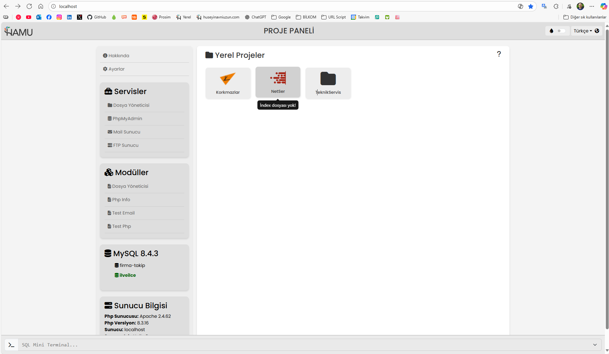
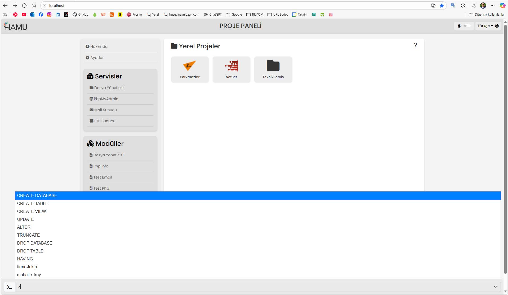
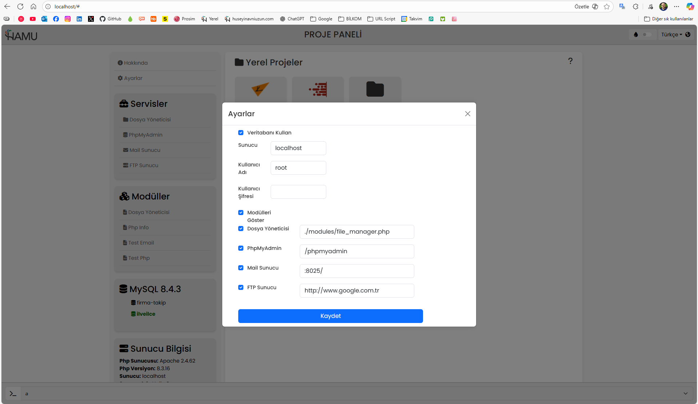

# HAMU LOCAL PROJECTS PANEL

**HAMU LOCAL PROJECTS PANEL**, yerel geliştirme ortamında projeleri kolayca yönetebilmeniz için geliştirilmiş, modüler yapıya sahip ve genişletilebilir bir kontrol panelidir. Proje; çoklu dil desteği, dinamik veritabanı kontrolü, modül entegrasyonu, yerel dosya yöneticisi, mini SQL terminali gibi pek çok özelliği bünyesinde barındırır.

---

## Hızlı Başlangıç

Gereksinimler
- PHP 7.3+ (öneri: 8.2+)
- Apache (.htaccess desteği) veya Nginx + PHP-FPM
- PDO uyumlu veritabanları (MySQL/MariaDB ile test edilmiştir), gerekli PHP uzantıları: pdo, mbstring, json, curl

```bash
# 1) Repo
git clone https://github.com/huseyinavniuzun/hamu-local-projects-panel.git
cd hamu-local-projects-panel

# 2) (Varsa) bağımlılıklar
# composer install

# 3) (Otomatik oluşmuyorsa) config örneği
# cp .hamu/config.example.json .hamu/config.json

# 4) Lokal deneme (PHP built-in)
php -S localhost:8000 -t .

# 5) Tarayıcı
# http://localhost:8000
```

## Özellikler

- **Modüler Yapı:** Yeni PHP dosyaları ekleyerek sistem genişletilebilir.  
- **Çoklu Dil:** `lang.php` ve `lang_switcher.php` üzerinden dil desteği.  
- **SQL Terminal:** `db_actions.php` ile canlı SQL sorguları, autocomplete desteği.  
- **Responsive File Manager:** Dosya yönetimi için hazır modül.  
- **Özel CSS/JS:** `.hamu/css` ve `.hamu/js` dizinleri üzerinden özelleştirme.  
- **Cache & Logs:** Sistem kendi cache ve log mekanizmasına sahiptir.  

## Ekran Görüntüleri




- Detaylı kurulum: [docs/INSTALL.md](docs/INSTALL.md)

## 1. Giriş

Bu dokümantasyon, sistemin genel yapısını, klasör/dosya organizasyonunu, modül entegrasyon sürecini ve temel kullanım yönergelerini kapsamaktadır. Geliştiriciler ve kullanıcılar için sistemi daha iyi anlamaya yardımcı olmayı amaçlar.

---

## 2. Klasör Yapısı

Projenin ana dizini ve alt klasörlerinin yapısı aşağıdaki gibidir:

```
/ (Proje Kök Dizin)
│
├── index.php                    # Uygulamanın giriş noktası, ana kontrol paneli
│
└── .hamu/
    │
    ├── h_header.php             # Sayfa üst tag yapısı + CSS / Bootstrap vb
    ├── h_navbar.php             # Navigasyon yapısı (özelleştirilebilir)
    ├── h_sidebar.php            # Menü yapısı, responsive ve offcanvas mod
    ├── h_footer.php             # Sayfa alt tag yapısı (result modal + settings modal)
    ├── config.json              # Sistem ayarlarının tanımlandığı JSON dosyası
    ├── config.php               # Ayarları yöneten PHP dosyası
    ├── database.php             # Veritabanı bağlantı işlemleri
    ├── functions.php            # Genel yardımcı fonksiyonlar
    ├── db_actions.php           # SQL terminal işlevselliği, sorgu yardımı, otomatik tamamlama
    ├── lang.php                 # Çoklu dil desteği için dil dosyası
    ├── lang_switcher.php        # Dil değiştirme arayüzü
    ├── about.php                # Geliştirici ve uygulama bilgisi
    ├── readme.php               # Markdown okuma sayfası
    ├── cache/
    │   └── cache_autocomplete.json # Autocomplete cache dosyası
    ├── logs/
    │   └── db_terminal.log      # SQL terminal log dosyası
    ├── css/
    │   └── custom.css           # Özel stil dosyası
    ├── js/
    │   ├── general.js           # Genel JavaScript işlevleri
    │   ├── dbactions.js         # SQL terminali ve veritabanı etkileşimleri
    │   └── extra.js             # Ekstra sayfa ve modül scriptleri
    ├── images/
    │   ├── favicon/             # Favicon dosyaları
    │   └── manifest.json        # Uygulama manifest dosyası
    └── modules/
         ├── file_manager.php    # Responsive dosya yöneticisi (örnek modül)
         └── (Diğer modül dosyaları)
               # Örneğin: modul_example.php
               # Bu dosyalarda yer alan "$page_title" tanımı, index.php üzerinde modül listesinde gösterilir.
               # Translate(lang) desteği ile dil dosyasındaki gibi gösterir, yoksa yazıldığı gibi.
```

---

## 3. Dosya ve Fonksiyon Açıklamaları

### 3.1 Ana Dosyalar ve Çalıştırma Gereksinimleri

- **index.php:** Panelin giriş noktasıdır. Tüm modüller, navigasyon ve içerik yüklemelerini gerçekleştirir.
- **config.json:** Sistem ayarları (veritabanı ayarları, modüllerin aktiflik durumları vb.) bu dosyada tutulur ve kullanıcı tarafından düzenlenebilir.
- **config.php:** Ayarları global hale getirir, bir kez yükleyerek verimli çalışmayı sağlar.
- **database.php:** Veritabanına bağlanmak için PDO kullanan bağlantı ayarlarını sağlar.
- **functions.php:** Sistemin genel fonksiyonlarını içerir, örneğin;
  - Proje klasörlerini listeleme.
  - Modül dosyalarını tarama.
  - Sistem sürüm bilgilerini alma.
- **db_actions.php:** SQL terminali ve sorgu işlemlerini yönetir; kullanıcıların sorgularını çalıştırmasına ve sonuçları görmesine imkân verir.
- **lang.php & lang_switcher.php:** Çoklu dil desteği için gerekli metinleri ve kullanıcı tarafından dil değiştirme işlevlerini sağlar.
- **file_manager.php:** Responsive dosya yöneticisi, dosya yükleme, silme, düzenleme işlemlerini destekler.
- **custom.css:** Görünüm ve temaların özelleştirilmesi için gerekli CSS tanımlarını içerir.

### 3.2 JavaScript Dosyaları

- **general.js:** Arayüz bileşenleri ve genel olay yönetimini sağlar.
- **dbactions.js:** SQL terminali fonksiyonları; sorgu geçmişi, otomatik tamamlama, hata yönetimi.
- **extra.js:** Ekstra modül ve sayfaların JavaScript kodlarını yüklemek için kullanılır.

---

## 4. Modül Ekleme ve Entegrasyon

Yeni modüller, `.hamu/modules/` dizinine eklenir ve aşağıdaki kriterlere uymalıdır:

- Dosya adlarında nokta (.) kullanılmaz.
- Her modül dosyası içinde `$page_title` tanımı yapılmalıdır:

```php
<?php
$md_file       = "modul.md";                // Markdown dosyası (opsiyonel)
$page_title    = "Modül Başlığı";           // Modülün gösterilecek başlığı
$body_class    = "";                        // Body etiketi için CSS sınıfları
$include_db    = 0;                         // Veritabanı bağlantısı (0=hayır, 1=evet)
$menu_type     = 1;                         // Menü gösterimi (0=mobil, 1=tüm ekranlar)

require_once $_SERVER['DOCUMENT_ROOT'].'/.hamu/h_header.php';
require_once $_SERVER['DOCUMENT_ROOT'].'/.hamu/h_navbar.php';
?>

<h1>Modül İçeriği</h1>

<?php echo markdown($md_file); ?> <!-- Opsiyonel -->
<?php translate('yazı'); ?> <!-- Dil çeviri opsiyonel -->

<?php require_once $_SERVER['DOCUMENT_ROOT'].'/.hamu/h_footer.php'; ?>
```

Sistem otomatik olarak yeni modülleri algılar ve kullanıcı arayüzünde listeler.

---

## 5. SQL Terminal Kullanım Yönergeleri

SQL terminalinde sorgularınızı yazıp çalıştırabilirsiniz:

- Terminal üzerinden sorguları çalıştırmak için giriş alanına yazıp çalıştır düğmesine veya Enter tuşuna basınız.
- Çoklu sorguları noktalı virgül (;) ile ayırarak çalıştırabilirsiniz.
- Geçmiş sorgularınız, shift + yukarı/aşağı yön tuşlarıyla erişilebilir.
- Otomatik tamamlama özelliği aktif olup sorgularınızı yazarken öneriler sunulur.

---

## 6. Kullanım ve Özelleştirme

- Sistem ayarları `config.json` üzerinden yapılandırılır.
- Dil ayarları, tema özelleştirme ve ekstra fonksiyonları özelleştirmek mümkündür.

---

## 7. Katkı

1. Repo’yu fork edin.  
2. Branch oluşturun: `feature/...` veya `fix/...`.  
3. Kodunuzu yazıp commit edin.  
4. PR açın, açıklamaları doldurun.  

Ayrıntılı kurallar için [CONTRIBUTING.md](CONTRIBUTING.md) dosyasına bakın.

---

## 8. Lisans ve Kullanım

Bu proje, açık kaynak kodlu olup **MIT Lisansı** ile dağıtılmaktadır.  
Responsive File Manager da MIT lisansı ile kullanılmaktadır.

Bu proje içinde **Responsive File Manager** kullanılmaktadır ve aşağıdaki lisans koşullarına tabidir:
- Responsive File Manager, **M. Edoardo Tripodi** tarafından geliştirilmiş olup **MIT Lisansı** ile dağıtılmaktadır.
- Orijinal proje sayfası: [https://github.com/trippo/ResponsiveFilemanager](https://github.com/trippo/ResponsiveFilemanager)

Bu lisansa göre:
- Projeyi ticari veya kişisel olarak kullanabilirsiniz.
- Ancak orijinal lisans bilgilerini ve yazarı belirtmek zorundasınız.
- Proje içindeki `LICENSE` dosyasını ve ilgili dosyalardaki telif hakkı bilgilerini silmemeniz gerekmektedir.

---

## 9. Sistem Gereksinimleri

- PHP 7.3 veya üzeri
- MySQL veya SQLite
- Apache veya Nginx
- PHP Eklentileri: `pdo`, `json`, `mbstring`, `curl`

---

## 10. Geliştirici Notları

- **Genişletilebilirlik:**  
  Sistem, modüler yapısı sayesinde ek modüller ile kolayca genişletilebilir. Geliştiricilerin kullanabileceği örnek modül dosyaları ve API dokümantasyonunun hazırlanması önerilir.

- **Güvenlik:**  
  - Konfigürasyon ve sistem dosyaları dış erişime kapalı tutulmalıdır.  
  - `.hamu/`, `logs/` ve `config.json` **kesinlikle public erişime açık olmamalıdır**.  
  ** Apache için örnek `.htaccess`:  
  ```apache
  RewriteEngine On
  RewriteRule ^\.hamu/ - [F,L,NC]
  <FilesMatch "\.(json|lock|env|ini|log)$">
    Require all denied
  </FilesMatch>
  ```
  ** Nginx eşdeğeri:  
  ```nginx
  location ~* ^/\.hamu/ { deny all; }
  location ~* \.(json|lock|env|ini|log)$ { deny all; }
  ```
  - Özellikle veritabanı bağlantıları ve PHP eval gibi fonksiyonların kullanımı dikkatle ele alınmalı, güvenlik açıklarına karşı önlemler alınmalıdır.
  - Nginx yapılandırması: [docs/NGINX_Bilgilendirme.md](docs/NGINX_Bilgilendirme.md)
  - JSON dosyalarının güvenliği: [docs/json_security.md](docs/json_security.md)

- **Bakım:**  
  Düzenli dosya ve klasör yapısı, ileride yapılacak güncellemeler ve yeni özellik eklemeleri için büyük avantaj sağlar.

---


## 11. Sonuç

HAMU LOCAL PROJECTS PANEL, kapsamlı ve modüler bir yapı ile kullanıcı ve geliştiricilere yerel projelerini etkin biçimde yönetmeleri için güçlü araçlar sağlar.

## Ek Notlar

- Dokümantasyon ve örnek modül dosyaları, projenin geliştirilmesi ve genişletilmesi için referans niteliğindedir.
- İlk çalıştırmada config.json otomatik oluşturulur. Eğer oluşmazsa config.example.json dosyasını kopyalayarak kendi ayarlarınıza göre düzenleyebilirsiniz.
