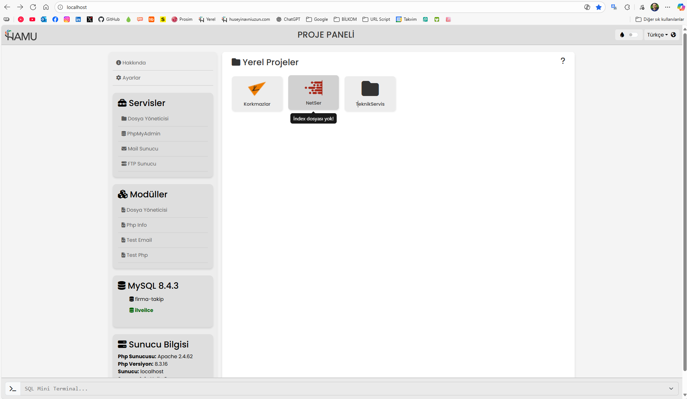
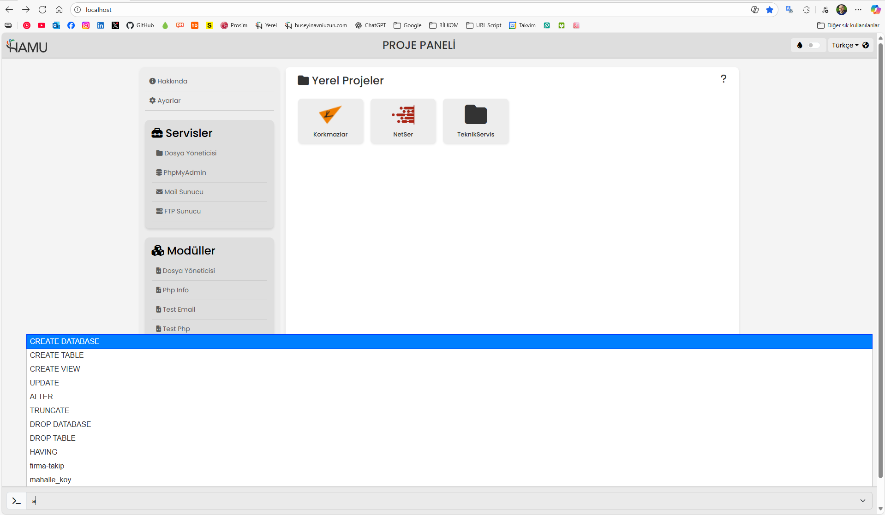
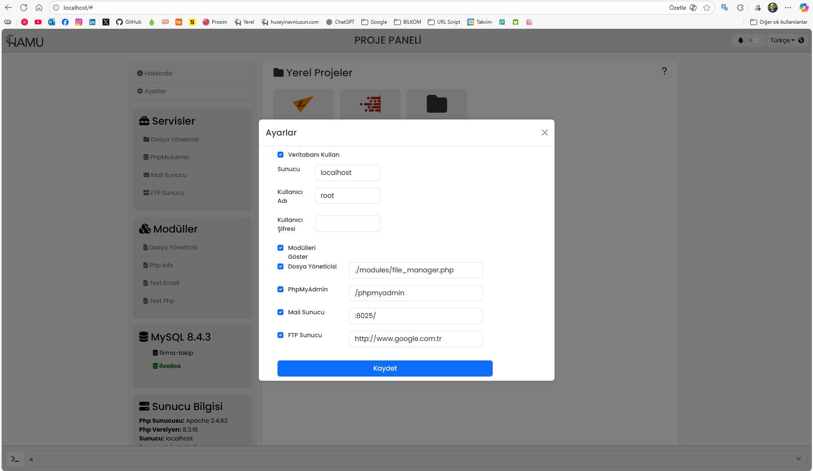

# HAMU Local Projects Panel

**Yerel web projeleri için tek bir çalışma paneli.**

PHP ile geliştirdiğim HAMU, proje klasörlerini ve geliştirme araçlarını ortak bir arayüzde topluyor. Günlük işlerde karşıma çıkan ihtiyaçları daha küçük, anlaşılır adımlarla çözmeye yönelik çalışmalarımın bir parçası.

[Kurulum](#başlangıç) · [Dağıtım](DEPLOYMENT.md) · [Katkı](CONTRIBUTING.md) · [MIT Lisansı](LICENSE)



## Neden geliştirdim?

Birden fazla yerel projeyle çalışırken klasörler, dosyalar ve veritabanı araçları arasında geçiş yapmak ayrı ayrı adımlara dönüşebiliyor. HAMU ile bu işlemler için ortak bir başlangıç noktası oluşturmaya çalışıyorum.

İhtiyacı fark etmek, çözüm denemek, hataları düzeltmek ve kullandıkça geliştirmek… Bu depo hem ortaya çıkan aracı hem de çözüm arayışımı gösteriyor.

## Neler var?

- Proje kartları, arama, sıralama ve filtreler.
- Tiny File Manager ile dosya yönetimi.
- SQL terminali ve veritabanı yardımcıları.
- FTP/proje işlemleri ve ek PHP modülleri.
- Türkçe/İngilizce arayüz, tema ve özel CSS/JavaScript desteği.
- Markdown ve günlük görüntüleyicisi.

Dosya yöneticisi, SQL terminali, FTP/proje işlemleri ve geliştirme modülleri yalnızca yerel loopback erişiminde (`127.0.0.1` / `::1`) kullanılabilir. İnternet erişiminde bu araçlar kapalıdır.

<details>
<summary>Diğer ekran görüntüleri</summary>





</details>

## Başlangıç

PHP 8.2 veya üzeri, `openssl`, `mbstring`, `PDO` ve kullanılacak veritabanına uygun PDO sürücüsü gerekir. Kullanılan araçlara göre `curl`, `ftp` veya `gd` uzantıları da gerekebilir.

```bash
git clone https://github.com/huseyinavniuzun/hamu-local-projects-panel.git
cd hamu-local-projects-panel
php -S 127.0.0.1:8000 -t .
```

Tarayıcıda `http://127.0.0.1:8000` adresini açın. Bu geliştirme sunucusu yalnızca yerel kullanım içindir.

Sunucuya taşımadan önce `setup-admin.php` ile yönetici parolası tanımlayın. Araç, `HAMU_SETUP_PASSWORD` ortam değişkeninden en az 16 karakterlik parola alır. Gizli giriş, sunucu erişim kuralları ve şifreleme anahtarı için [dağıtım rehberini](DEPLOYMENT.md) izleyin.

## Erişim ve güvenlik

İnternet erişiminde HTTPS ve yönetici kimlik doğrulaması zorunludur. Yazma isteklerinde CSRF kontrolü, giriş denemelerinde sınırlama ve oturum süresi kontrolü uygulanır. Yeni hassas değerler AES-256-GCM ile şifrelenir; TOTP ve kurtarma kodu yönetimi bulunur.

`.hamu/` altına doğrudan HTTP erişimi kapalı olmalıdır; sayfalar, API ve varlıklar `index.php` üzerinden sunulur. Özel yapılandırma, anahtarlar, günlükler ve veritabanları Git'e eklenmemelidir. Apache/Nginx ve ters proxy ayarları için [DEPLOYMENT.md](DEPLOYMENT.md) dosyasını okuyun.

PHP 8.3 sözdizimi, HTTP giriş ve ana panel, yetkili ayar güncellemesi, TOTP kaydı ve şifreli saklama ile CSRF ve dizin geçişi engelleri kontrol edildi. Canlı hosting, SMTP/FTP ve canlı veritabanı bağlantıları her kurulumda ayrıca doğrulanmalıdır.

## Geliştirme

`index.php` giriş noktasıdır. Ortak erişim kontrolleri `.hamu/security.php`, yönlendirmeler `.hamu/pub/`, yapılandırma `.hamu/config.php`, kimlik doğrulama `.hamu/auth.php` dosyalarındadır. Ek araçlar `.hamu/modules/`, stil ve JavaScript dosyaları `.hamu/assets/` altında bulunur.

İyileştirme fikirleri için issue açabilir veya [katkı rehberini](CONTRIBUTING.md) izleyebilirsiniz. Güvenlik bildirimlerini [güvenlik politikasındaki](SECURITY.md) kanaldan iletin.

## Geliştirici

**Hüseyin Avni Uzun · HAMU**

Tekrarlanan işleri kolaylaştıran araçlar geliştiriyor; deneyerek öğrendiklerimi kod ve kullanım belgeleriyle paylaşıyorum.

[GitHub](https://github.com/huseyinavniuzun) · [Web sitem](https://huseyinavniuzun.com) · [Excel için HAMU Tools](https://github.com/huseyinavniuzun/HAMU-Tools) · [Tarayıcı betiklerim](https://github.com/huseyinavniuzun/userscripts)

HAMU paneli [MIT Lisansı](LICENSE) ile dağıtılır. Tiny File Manager'ın lisansı [kendi dizininde](.hamu/include/filemanager/LICENSE) korunmuştur.